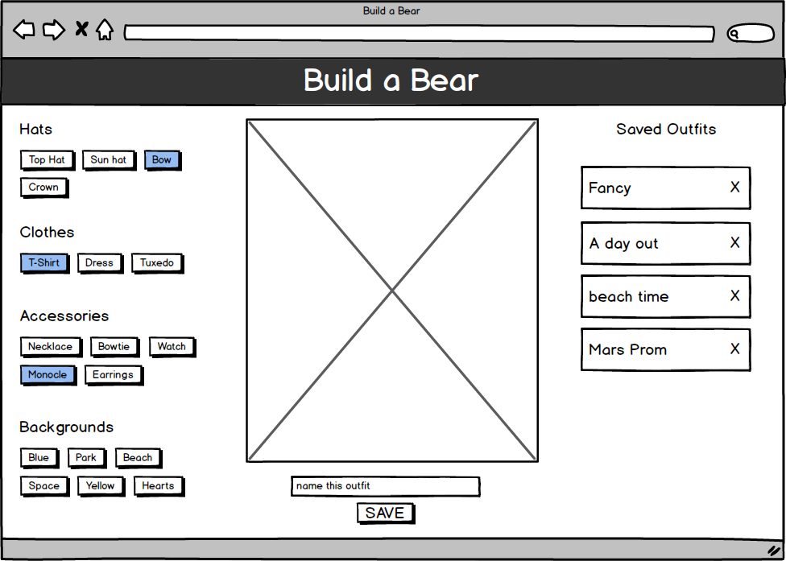
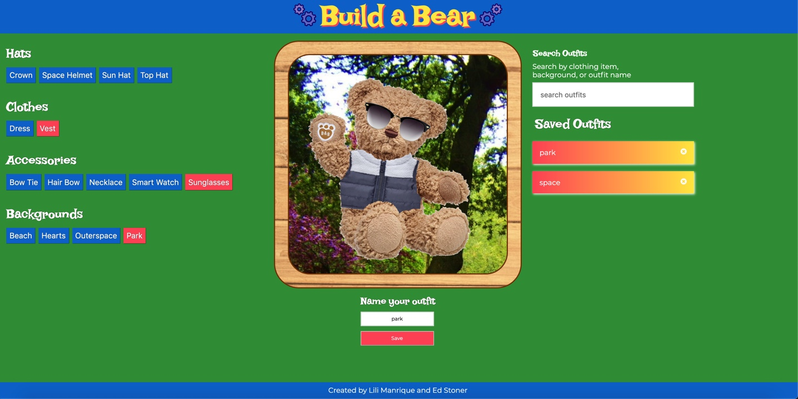

## README

# Overview of project and goals

In this project, we sought to create an application that allows users to add outfits
to a bear, save those outfits, and reload the outfits when revisiting the website. In
completing this application, we hoped to learn about the following:
- Creating classes and instantiating objects
- Using local storage to save and access data
- Writing concise code and using parameters wherever possible
- Deepen understanding of event bubbling and propagation

We completed all of the functionality components for iterations 1-5 and the following
user stories from iteration 6:
- Add data validation to ensure that no two outfits can be named the same thing
- Refactor so one outfit can contain more than one item from each category (i.e. the bear can wear more than one accessory, hat, etc, at a time).
- Score 95 or higher on the Chrome Dev Tools Accessibility Audit
- Add UI so users can filter saved outfits by the garments or background they include.
- Add UI so users can input text to search by term - the names of the saved outfits that match the search term should be the only ones to appear

# Technologies used, challenges, and wins

Technologies used:
- HTML
- CSS
- JavaScript

Challenges:
- Linking garment buttons to their associated garment images was our first major difficulty.
We were unsure the best way to go about doing this, but we eventually decided to link the button
classes to the image IDs.
- It was also challenging to make it so that only one garment of each type could be applied to the bear.
We had to toggle our formatting to have each button container loop over all of its children.
- Using local storage was straightforward, but using that stored information to manipulate DOM
elements was more difficult. We had to really dive deep into our objects to discuss which
keys we wanted to access and what our game plan was for doing so.

Wins:
- Local storage was much easier to work with than we had anticipated. Both of us now have
a strong grasp on how to use this JS feature.
- We both now have a stronger understanding of the practical applications of classes and objects.
Going into this project, our knowledge was mainly theoretical, but it now makes more sense
when and how we would use these datatypes.
- We both now feel more comfortable pairing and talking through our problem-solving processes.
It was difficult at first, but we spent time getting to know each other's learning styles and
have enhanced our professional collaboration skills because of it.

# Screenshots of comp and our app

# Contributors

- Ed Stoner: https://github.com/edlsto
- Lili Manrique: https://github.com/lmanriq
